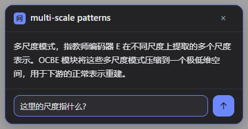

<div align="center">


# DeepSeek 伴读

**围绕 DeepSeek 模型能力与设计风格制作的阅读插件。**

谨以此作品，表达本人对 deepseek 的喜爱之情。

阅读英文网页或 PDF 时，选中词句，让 DeepSeek 结合前后文，沿着原文直接给出理解。

Chrome 扩展 · 网页与 PDF · 自备 DeepSeek API Key · 本地历史

</div>

## 沿着原文，陪你读

DeepSeek 伴读把 DeepSeek 放在正在阅读的文字旁边。回答沿用原文的对象、术语、主语和论述顺序，保留原文的限定与确定性；用自然的中文说明选中内容在这里的含义。没有默认的英文释义、词源栏目或固定输出模板。

模型接收前文与选区之后约 1000 字符的内容。继续提问时，同一张卡片带着上下文和之前的对话接着回答。

界面参考 DeepSeek 的蓝色、简洁层次和圆角设计：灰色 PDF 阅读区、清晰的正文、紧凑的对话卡片。输入时聚焦光环沿卡片外轮廓展开；标题与追问的“问”保持同一条左对齐线，关闭图标与发送箭头保持同一条右侧中心线。



## 阅读体验

- **完整选词**：自动补齐首尾漏选的英文字母，支持多个单词和反向拖选，并同步高亮。
- **连续的 PDF 文本**：按栏与段落整理文字，合并排版断词；例如跨行的 `detec- / tion` 会以 `detection` 解释。
- **自然追问**：在底部输入问题，按 Enter 或发送按钮，沿当前上下文继续阅读。
- **图文上下文**：PDF 的 Flash 查询可携带当前页及此前可识别图注所在页的图像，最多最近 12 个相关页。Pro 查询保持文本输入。
- **本地历史**：保存最近 200 次对话，可以搜索并回到原文。
- **深浅主题**：界面随系统主题切换，PDF 纸张周围保持中性灰色。
- **本地发音**：选中词句旁提供 Kokoro Q8 美式 Heart 发音；安装后自动下载约 92 MB 量化语音包，校验后缓存，之后可离线播放。
- **发音触发**：设置中可选择点击按钮播放，或选中后自动在后台生成并缓存（实际播放仍由按钮触发，兼容浏览器自动播放策略）。
- **发音音量**：设置中可单独调节 Kokoro 发音音量，不影响网页或 PDF 的其他声音。

## 安装

从源码构建：

```bash
git clone https://github.com/zzkws/SideNote.git deepseek-reading-companion
cd deepseek-reading-companion
npm ci
npm run build
```

1. 在 Chrome 打开 `chrome://extensions`，开启开发者模式。
2. 点击“加载已解压的扩展程序”，选择项目中的 `dist` 文件夹。
3. 在设置页填入自己的 [DeepSeek API Key](https://platform.deepseek.com/api_keys)，测试连接并保存。
4. 打开英文网页划选词句；阅读 PDF 时，点击扩展菜单中的“打开 PDF 阅读器”。

首次安装会在后台从 GitHub 下载 Kokoro Q8 语音包（Hugging Face 为备用源），设置页会显示进度。语音包只保存到浏览器本地，选中文字不会上传给发音引擎。

本地打包使用 `npm run zip`，生成 `deepseek-reading-companion.zip`。[Releases](https://github.com/zzkws/SideNote/releases) 中的历史安装包可能仍使用旧名称 `sidenote.zip`。

更新已有安装时，重新加载同一目录的扩展并刷新阅读页面；设置和历史的存储格式沿用原有实现。

## 上下文与模型

普通查询发送从文章开头到选区之后约 1000 字符的正文，末尾尽量扩展到句子或段落边界。超长正文超过 160000 字符的阈值时，保留开头和选区附近内容，并标明省略部分。

PDF 图注独立整理，避免插入正文的跨栏、跨页句子。页图用于核对图表和公式排布。当前代码在带图的 Flash 请求中使用 `deepseek-v4-flash-vision-exp`，纯文本查询使用设置中的模型。页图会增加输入用量，具体可用型号与费用以 DeepSeek 接口为准。

API Key 保存在本机 `chrome.storage.local`；调用时用于向配置的 API 地址认证。选中内容、所需上下文及相关页图会发送到该地址，默认是 DeepSeek。历史保存在浏览器本地。

PDF 文字恢复采用版面规则。复杂公式、表格及特殊排版需结合原图；扫描件没有可划选文字层时暂不支持直接划词。网页 iframe 内的选区暂不支持。

实现与验证说明见 [阅读链路](docs/reading-pipeline.md)。回答风格在 [prompt.ts](src/background/prompt.ts) 中集中维护。

## 开发

```bash
npm run dev      # 开发模式
npm run build    # TypeScript 检查并构建到 dist/
npm run zip      # 生成安装压缩包
npm run icons    # 重新生成图标
```

技术栈：Manifest V3、TypeScript、Preact、Vite、PDF.js、Readability、KaTeX。无须额外后端即可使用自己的 API Key。

本地语音运行时由 Kokoro、Transformers.js、ONNX Runtime Web 和 phonemizer.js 组成；各组件许可及固定版本见 [THIRD_PARTY_NOTICES.md](THIRD_PARTY_NOTICES.md)。Q8 模型数据使用固定 revision 并在下载后校验 SHA-256，不把 92 MB 权重放进源码仓库。

仓库沿用原 SideNote 地址。`docs/gold-examples.md`、旧截图和海报是早期设计存档，当前回答规则以代码中的系统提示词为准。

## English

**DeepSeek 伴读 / DeepSeek Reading Companion** is a reading extension built around DeepSeek models and DeepSeek-inspired interface design. Select words or sentences in an English webpage or PDF to receive a direct Chinese explanation grounded in the surrounding text. Continue asking questions in the same card.

Selection boundaries expand to complete English words, including words split across PDF lines. Responses use natural prose without a mandatory English gloss or fixed template. Bring your own DeepSeek API key; conversations are stored locally in your browser.

Build with `npm ci` and `npm run build`, then load `dist/` as an unpacked Chrome extension.

## License

MIT
